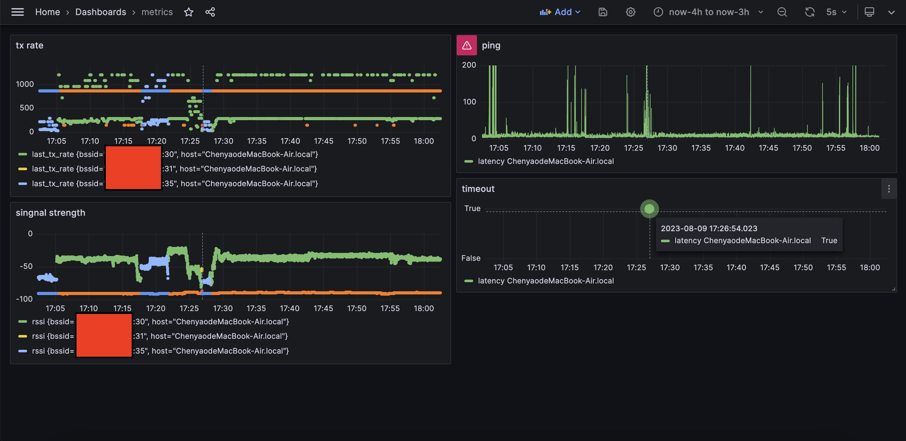

# WiFi-Metrics

Collects WiFi metrics and writes them to InfluxDB.



This is a simple script I used on my Mac to diagnose WiFi issues. It collects metrics from `airport`(So it only works on macOS) and `ping` and writes them to InfluxDB. Then I use Grafana to visualize them. For example, the above graph shows the ping latency and signal strength of our home WiFi in one hour.

To draw the signal graph, I used the following flux query:

```
from(bucket: "metrics")
  |> range(start: v.timeRangeStart, stop: v.timeRangeStop)
  |> filter(fn: (r) => r["_measurement"] == "wifi")
  |> filter(fn: (r) => r["_field"] == "rssi")
  |> filter(fn: (r) => r["bssid"] != "" and r["bssid"] != "0:0:0:0:0:0")
  |> yield(name: "rssi")
```

Feel free to play with the script and the query to suit your needs.